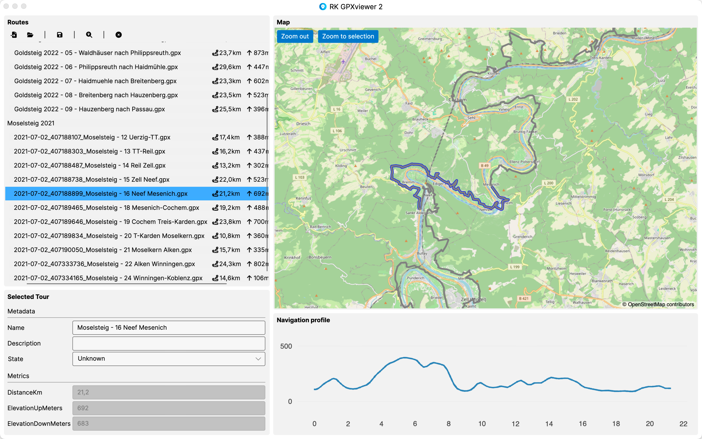
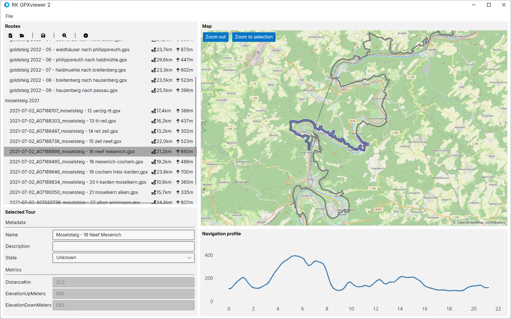

# RK GPXviewer 2 
## About
GPXviewer 2 is a cross-platform application to view .gpx (GPS Exchange Format) files. 
I started developing the inital Version 1 in preparation for a tour over the alps in summer 2021 (see https://github.com/RolandKoenig/GpxViewer). 
My problem on Version 1 was the fact, that I based it on WPF. Because of that, the tool was only available on Windows.
With Version 2 I migrated the project to Avalonia. This allows GPXviewer to run on most desktop operating systems out there.
I provide executables for Windows and macOS.

## Screenshots
### macOS

### Windows

## Project is based on...
GPXviewer is based on .Net 8 and the UI framework [Avalonia](https://github.com/AvaloniaUI/Avalonia).

Furthermore the project is based on following technologies / projects:
 - [CommunityToolkit](https://github.com/CommunityToolkit/dotnet): .NET Community Toolkit is a collection of helpers and APIs that work for all .NET developers and are agnostic of any specific UI platform
 - [FluentAssertions](https://github.com/fluentassertions/fluentassertions): A very extensive set of extension methods that allow you to more naturally specify the expected outcome of a TDD or BDD-style unit tests
 - [Icons.Avalonia](https://github.com/Projektanker/Icons.Avalonia): A library to easily display icons in an Avalonia App
 - [Live-Charts2](https://github.com/beto-rodriguez/LiveCharts2): Simple, flexible, interactive & powerful charts, maps and gauges for .NET
 - [Mapsui](https://github.com/Mapsui/Mapsui): Mapsui is a .NET Map component for Avalonia, WPF and many more platforms
 - [NSubstitube](https://github.com/nsubstitute/NSubstitute): A friendly substitute for .NET mocking libraries
 - [RolandK.AvaloniaExtensions](https://github.com/RolandKoenig/RolandK.AvaloniaExtensions): A .NET library which extends Avalonia with commonly used features like ViewServices, DependencyInjection and some Mvvm sugar
 - [RolandK.Formats.Gpx](https://github.com/RolandKoenig/RolandK.Formats.Gpx): A .NET Standard library for reading and writing GPX (GPS Exchange Format) files
 - [RolandK.InProcessMessaging](https://github.com/RolandKoenig/RolandK.InProcessMessaging): A messenger implementation which sends / receives in process messages
 - [Svg.Skia](https://github.com/wieslawsoltes/Svg.Skia): An SVG rendering library
 - [xunit](https://github.com/xunit/xunit): xUnit.net is a free, open source, community-focused unit testing tool for .NET